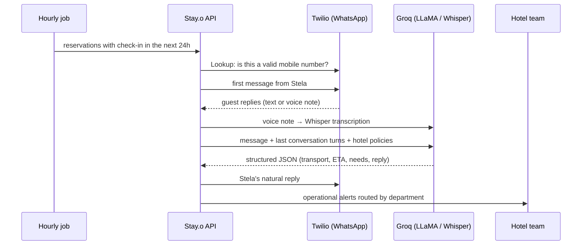

# Stay.o — AI guest concierge for hotels (backend)

> Stela, an AI concierge, talks to hotel guests on **WhatsApp** before they arrive. She finds out how and when they're coming and what they need, then turns that into **operational alerts for the right hotel department**.

I built this after years at the front desk of 5-star hotels. The reception team spends hours on the phone asking the same questions before every arrival, and details like "we're travelling with a baby" get lost between shifts.

**Stack:** Node.js · Express 5 · MySQL · Twilio WhatsApp API · Groq (LLaMA 3.3-70B, Whisper) · JWT · bcrypt · node-cron
**Frontend:** [stayo-frontend](https://github.com/erickviniciusf/stayo-frontend) (React + Vite)

---

## How it works



### 1. Eligibility job (`src/jobs/elegibilidade.job.js`)
Runs **every hour** with node-cron, and only inside the hotel's operating window (10:00–18:00), so guests aren't messaged at night.
It picks confirmed reservations with check-in in the next 24 hours that don't have a session yet, **validates the phone number with Twilio Lookup** before any message goes out, and suspends the session if the number isn't valid.

### 2. Stela, the conversational layer (`src/controllers/stela.controller.js`)
- **Voice notes:** audio from WhatsApp is transcribed with **Groq Whisper (large-v3)**.
- **Structured output:** LLaMA 3.3-70B returns **JSON only**, with transport, ETA normalised to `HH:MM` ("3 da tarde" → `15:00`), tone, detected needs and the reply text. The code acts on the data, and the guest only sees the reply.
- **Context:** conversation history per guest session, plus the **hotel's own policies** (check-in and check-out times, early check-in price) injected into the prompt. Stela answers with the real rules, not made-up ones.

### 3. Operational alerts
Needs detected in the conversation become alerts with a **priority and a responsible department**:

| Need | Priority | Routed to |
|---|---|---|
| Travelling with a baby | high | Housekeeping (prepare a crib) |
| Travelling with a pet | high | Front desk |
| Special occasion | medium | Concierge |
| Late arrival | medium | Night audit |
| Special room request | medium | Front desk |

---

## API

| Area | Endpoints | Auth |
|---|---|---|
| Auth | `POST /api/auth/login` | — (returns a JWT) |
| Hotels | `GET/POST /api/hoteis`, `GET/PUT /api/hoteis/:id` | JWT |
| Reservations | `GET/POST /api/reservas`, `GET/PUT /api/reservas/:id` | JWT |
| Guest sessions | `GET/POST /api/sessoes`, `GET/PUT /api/sessoes/:id` | JWT |
| Stela | `POST /api/stela/disparar`, `POST /api/stela/webhook` (Twilio) | — |
| Alerts | `GET /api/alertas`, `GET/PUT /api/alertas/:id` | JWT |
| Hotel policies / concierge content | `GET/POST/PUT /api/politicas/:hotel_id`, `/api/concierge/:hotel_id` | JWT |

Security basics: **bcrypt** password hashing, **JWT** auth middleware, **rate limiting** (100 requests per 15 min per IP), input-validation middleware and CORS restricted to the frontend origin.

## Data model (MySQL)

`hoteis` · `politicas_hoteis` · `hoteis_conteudo_concierge` · `reservas` · `sessoes` · `mensagens` · `alertas_operacionais`

## Run locally

```bash
npm install
cp .env.example .env   # fill in the values below
npm run dev
```

```
PORT=3000
DB_HOST=  DB_PORT=  DB_USER=  DB_PASSWORD=  DB_NAME=
JWT_SECRET=
GROQ_API_KEY=
TWILIO_ACCOUNT_SID=  TWILIO_AUTH_TOKEN=  TWILIO_WHATSAPP_FROM=
```

To receive WhatsApp replies locally, expose the server with a tunnel (e.g. ngrok) and point the Twilio sandbox webhook to `/api/stela/webhook`.

---

## Status and next steps

This is a working prototype, run locally against the Twilio WhatsApp sandbox. It is not deployed yet. Here is what I'd do before putting it in front of a real hotel:

- [ ] Validate the **Twilio request signature** on the webhook
- [ ] Require JWT on `POST /api/stela/disparar`, and stop returning raw error messages to clients
- [ ] Automated tests (I did this on my later project, [RiVolto](https://github.com/erickviniciusf/rivolto-case-study): 500+ tests in CI)
- [ ] Send the *last* N messages as context (the query currently takes the first N)
- [ ] Versioned SQL migrations and a `.env.example`
- [ ] Deploy (the API and MySQL on a managed host)

---

Built by **Erick Vinicius** · [LinkedIn](https://linkedin.com/in/erick-development) · [GitHub](https://github.com/erickviniciusf)
